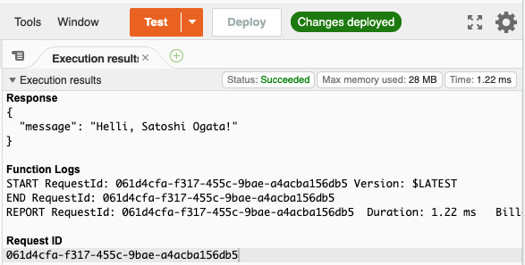

# Hello Rust Lambda

This repository is an example of AWS Lambda function empowered by Rust language.

## Create build environment

```shell-session
$ brew install rustup-init
...
$ rustup-init # select default on prompt
...
$ exec $SHELL -l
$ rustup target add x86_64-unknown-linux-musl
...
$ brew install filosottile/musl-cross/musl-cross
...
$ echo '[target.x86_64-unknown-linux-musl]
linker = "x86_64-linux-musl-gcc"' >> ~/.cargo/config
$
```

## Clone this repository

```shell-session
$ git clone https://github.com/satosystems/hello-rust-lambda.git
...
$
```

## Build for Local

Clone this repository.

```shell-session
$ cargo build
...
```

## Build for AWS

```shell-session
$ cargo build --release --target x86_64-unknown-linux-musl
...
$ (cd target/x86_64-unknown-linux-musl/release && \
    cp hello-rust-lambda bootstrap && \
    zip -j bootstrap.zip bootstrap && \
    rm bootstrap)
...
$
```

## Upload to AWS and run test

Upload `target/x86_64-unknown-linux-musl/release/bootstrap.zip` to AWS Lambda.
And test with the following JSON.

```json
{ "givenName": "Satoshi", "familyName": "Ogata" }
```

### Execution results


